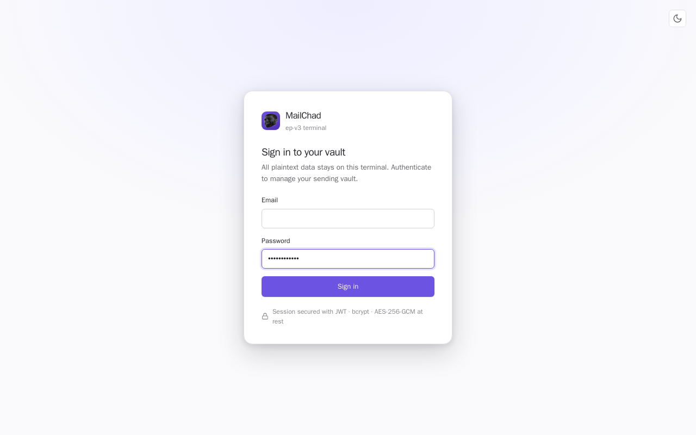

# MailChad - email campaigns the server can't read

MailChad sends email campaigns without the relay in the middle ever being able
to read them. You run a small admin app on your own machine, and that's where
your contacts, templates and encryption keys stay. When you launch a campaign
your machine encrypts every message before handing it to a cloud relay, which
passes it on to the email provider and immediately discards it - so even if the
relay is fully compromised, an attacker gets neither your mail nor your contact
list. It also paces sending to stay inside provider limits, honours
unsubscribes and bounces automatically, and runs on AWS's free tier for roughly
nothing.



[](https://github.com/roeybar/MailChad/actions/workflows/ci.yml)

**Status:** v3.23 - 145/145 pytest, end-to-end verified. Deployable on AWS free tier.

**Spec:** [`docs/lambda-dynamo-spec.md`](docs/lambda-dynamo-spec.md)

**Client deploy guide:** [`docs/CLIENT_HOSTED_DEPLOY.md`](docs/CLIENT_HOSTED_DEPLOY.md)

---

## What this is

Email platform with strict security separation across two process types:

- **ep-api Lambda** - always-on, public-facing (API Gateway -> Lambda).
  Handles sync, handshake, packs push, webhook, compliance endpoints.
  Holds K_op_pub + K_cl_pub + K_temp (TTL-bounded). Cannot decrypt K_op+K_cl payloads.
- **ep-dispatcher Lambda** - SQS-triggered, on-demand. Decrypts packs with
  K_temp, POSTs to Resend, discards plaintext. Warms/cools independently of ep-api.
- **terminal** - one per party (operator + client), runs on a laptop.
  Localhost-only admin UI. Holds full local DB cache + KEM private keys.
  Syncs to cloud via short-poll (5s interval).

Storage: **DynamoDB single-table** (all entities) + **SQS** (send queue).
No always-on VPS required. Infra cost is $0 at low volume on AWS free tier.

---

## Quick start (local dev)

```bash
# 1. Create .env
cp .env.example .env
# Edit: set BOOTSTRAP_TOKEN to any long random string

# 2. Boot everything locally (DynamoDB Local + localstack SQS + cloud + dispatcher + terminal)
scripts/v3 up

# 3. Create DynamoDB table + SQS queue (first time only)
scripts/v3 setup-tables

# 4. One-time handshake (during a screen-share with the other party)
scripts/v3 init-handshake --role operator \
                       --cloud http://cloud:8443 \
                       --bootstrap-token <BOOTSTRAP_TOKEN>

# 5. Backup your keys
scripts/v3 backup

# 6. Admin UI
open http://localhost:8011/admin
```

---

## Production deploy (AWS free tier)

```bash
# One-time: create DynamoDB table + SQS queue in prod AWS
scripts/v3 setup-tables

# Deploy the two Lambdas (needs AWS_ACCESS_KEY_ID + AWS_SECRET_ACCESS_KEY in .env)
scripts/v3 deploy-api          # -> prints API Gateway URL
scripts/v3 deploy-dispatcher   # -> wires SQS trigger

# Handshake both parties against the API Gateway URL
scripts/v3 init-handshake --role operator \
                       --cloud https://<api-gw-id>.execute-api.us-east-1.amazonaws.com \
                       --bootstrap-token <BOOTSTRAP_TOKEN>

# Tail Lambda logs
scripts/v3 tail-api
scripts/v3 tail-dispatcher
```

Client setup: see [`docs/CLIENT_HOSTED_DEPLOY.md`](docs/CLIENT_HOSTED_DEPLOY.md) -
they only run a terminal, no cloud infra needed.

---

## All `scripts/v3` verbs

```
scripts/v3 up                Start cloud + dispatcher + terminal (dev mode)
scripts/v3 up-cloud          Start cloud only
scripts/v3 up-terminal       Start terminal only (client deploy)
scripts/v3 down              Stop everything
scripts/v3 bounce            Restart (keeps volumes)
scripts/v3 logs [svc]        Tail logs (cloud|ep-v3-dispatcher|terminal)
scripts/v3 shell <svc>       Interactive shell
scripts/v3 ps                List containers
scripts/v3 init-handshake    One-time keypair exchange with peer + cloud
scripts/v3 backup            Encrypted zip of state + keys
scripts/v3 admin-bcrypt      Generate ADMIN_PASSWORD_HASH
scripts/v3 check <name>      Health/consistency checks (all = full sweep)
scripts/v3 probe <name>      Adversarial leak probes
scripts/v3 setup-tables      Create DynamoDB table + SQS queue (local or prod)
scripts/v3 deploy-api        Package + deploy ep-api Lambda
scripts/v3 deploy-dispatcher Package + deploy ep-dispatcher Lambda
scripts/v3 tail-api          CloudWatch log tail for ep-api
scripts/v3 tail-dispatcher   CloudWatch log tail for ep-dispatcher
```

---

## Configuration model

Only **one env var** (`BOOTSTRAP_TOKEN`) is required before first boot.
Everything else lives in DynamoDB-backed settings, editable via the admin UI.

| Tab | Settings |
|---|---|
| Brand | Company name, support email, postal address, public host, from-address |
| Auth | Admin email, password, JWT secret |
| Cloud | Resend webhook secret |
| Secrets | UNSUB + ERASURE HMAC secrets (auto-synced cloud↔terminal) |

Secrets are AES-256-GCM encrypted at rest with a per-side KEK.

---

## Code layout

```
src/mailchad/
  terminal/       local admin UI + sync client (runs on an operator's machine)
    migrations/   SQLite schema migrations
  cloud/          public API + dispatcher (deploys as two AWS Lambdas)
deploy/           Dockerfiles, entrypoints, IAM policies, Lambda packaging
scripts/          v3 CLI (up/down/deploy/backup/probe) + helpers
tests/            pytest suite - runs the whole codebase in one env
docs/             architecture + deployment guides
```

Both sides are subpackages of one installable package (`src/` layout), so
`mailchad.terminal` and `mailchad.cloud` import unambiguously and the full test
suite runs in a single environment.


## Hard rules

1. **Cloud never has private keys.** Only K_op_pub, K_cl_pub, K_temp (TTL-bounded).
2. **K_temp on cloud is TTL-bounded.** 1h/24h/7d; wiped on expiry; never extended.
3. **Plaintext window during dispatch = milliseconds.** Decrypt -> POST -> discard.
4. **Bearer auth on every sync/pack/key endpoint.** Bearer SHA-256-hashed in DynamoDB.
5. **Webhook events encrypted to BOTH pubkeys** (outlive K_temp TTL).
6. **Secrets encrypted at rest** with per-side KEK; decrypted only on read.
7. **One env var required:** `BOOTSTRAP_TOKEN`. Everything else UI-driven.

---

## Tests

```bash
# Run inside project container (no pulled-generic images)
docker run --rm \
  -v $(pwd)/tests:/work/tests \
  -v $(pwd)/cloud:/work/cloud \
  -v $(pwd)/terminal:/work/terminal \
  -e AWS_DEFAULT_REGION=us-east-1 \
  -e AWS_ACCESS_KEY_ID=test \
  -e AWS_SECRET_ACCESS_KEY=test \
  -e DYNAMODB_TABLE=ep-v3-test \
  -e BOOTSTRAP_TOKEN=test-token \
  -e DISABLE_DISPATCHER=1 \
  email-platform-v3-cloud \
  python -m pytest /work/tests -q

# 104/104 across:
#   dynamo ops (counters, events, packs, sessions, pubkeys, compliance, K_temp)
#   dispatcher (SQS record -> decrypt -> mock Resend -> sent/failed/stuck/retry)
#   sync protocol (push/pull cursor / near-conflict / auth)
#   handshake (register, bad bootstrap, duplicate-role)
#   packs API (push/idempotency/cancel/enqueue/auth)
#   webhook (HMAC/replay/duplicate/suppression)
#   settings (KEK lifecycle, at-rest encryption, tamper detection, env-fallback)
#   encryption (K_op+K_cl + K_temp + cross-side round-trips)
```

---

## Trade-offs (acknowledged)

- Each terminal holds BOTH private keys (Reading A). One-PC compromise = full breach.
  Mitigated by 6-location backup against data LOSS, not DISCLOSURE.
- Cloud holds K_temp during TTL. Cloud compromise during TTL = readable K_temp payloads.
  Operator picks TTL (1h/24h/7d) to size blast radius.
- Lambda cold-start ~800ms (Mangum + FastAPI). Acceptable for sync/webhook.
  Add provisioned concurrency if handshake UX suffers.
- Last-write-wins by Lamport revision; near-simultaneous edits are flagged so
  the operator can confirm the surviving version was the intended one.
- Single-tenant (one DynamoDB table per engagement, NOT multi-client SaaS).

---

## Heritage

- **v1** - AWS Amplify, PRD-faithful. 8 AWS services. Still running at a
  client company.
- **v2** - state/sender split via WireGuard. Shipped 2026-05-18.
- **v3.0** - cloud-sync spinnable; all secrets env-driven.
- **v3.1** - settings moved to DB-backed + UI-editable. Client-hosted-deploy guide.
  Cloudflare Tunnel model.
- **v3.2** - Lambda + DynamoDB. No always-on VPS. Dispatcher decoupled to SQS.
  Client runs terminal only; operator deploys two Lambdas once.
- **v3.8** - Multi-company support, WireGuard mesh, full live e2e suite (106 tests).
- **v3.9** - MailChad design system (oklch, light/dark, icon nav). Settings moved
  inline to feature pages. JSON/HTML template import.
